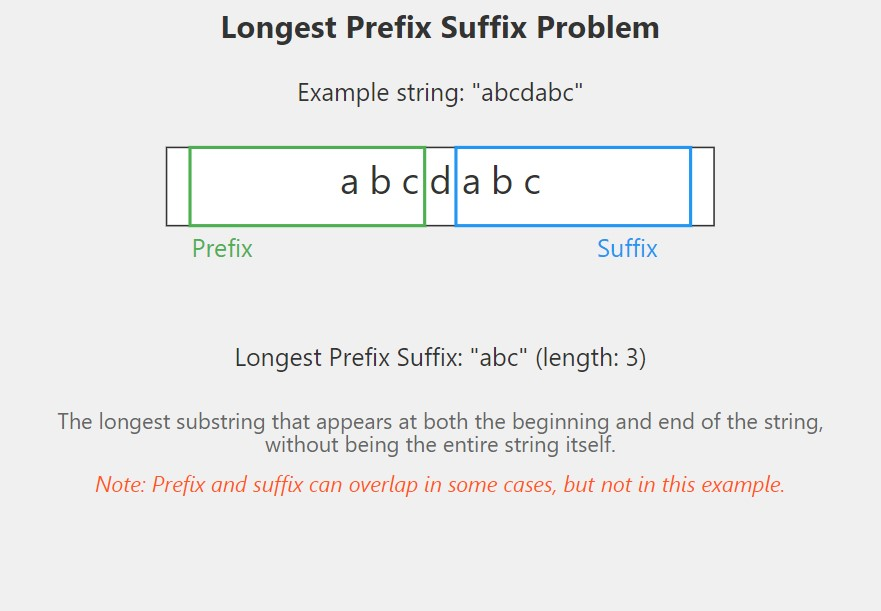

# Longest Prefix Suffix 📏

## Problem Statement

Given a string of characters, find the length of the longest proper prefix which is also a proper suffix. Note that the prefix and suffix can be overlapping, but they should not be equal to the entire string.

### Function Description

You need to implement the following function:

```java
class Solution {
    int lps(String str) {
        // code here
    }
}
```

### **Input Format**

- A string str containing lowercase English alphabets.

### **Output Format**

- Return an integer representing the length of the longest proper prefix which is also a proper suffix.

## 📊 Examples

### Example 1

#### Input:

```
str = "abab"
```

**Output:**

```java
2
```

### Explanation:

The longest proper prefix and suffix is "ab".

### Example 2

#### Input

```
str = "aaaa"
```

**Output:**

```java
3
```

#### Explanation:

The longest proper prefix and suffix is "aaa".

## 🧠 Approach and Solution



- Use the `KMP algorithm` to compute the LPS (Longest Prefix Suffix) array.
- The LPS array helps in finding the longest prefix which is also a suffix in linear time.
- Iterate through the string while maintaining a prefix length variable and updating it based on character matches.

# Time Complexity

O(n), where n is the length of the string.

# Space Complexity

O(n), for the LPS array.

# Contributions

Feel free to contribute by sharing your insights, optimizations, or any alternative approaches you have for solving this problem. Pull requests are welcome!

# Contact

For any questions or suggestions, please contact me
