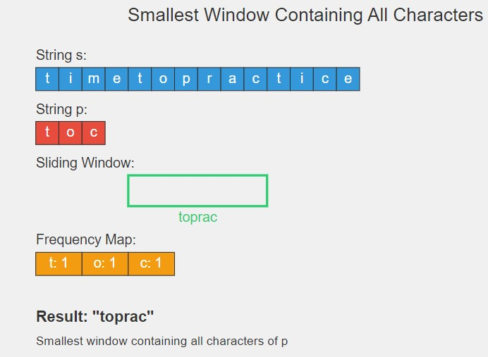

# Smallest Window in a String Containing All Characters of Another String 🔍

## Problem Statement

Given two strings `s` and `p`, find the smallest window in the string `s` that consists of all the characters (including duplicates) of the string `p`. If there is no such window present, return `"-1"`. In case there are multiple such windows of the same length, return the one with the least starting index.

### Function Description

You need to implement the following function:

```java
class Solution {
    // Function to find the smallest window in the string s consisting
    // of all the characters of string p.
    public static String smallestWindow(String s, String p) {
        // Your code here
    }
}
```

### **Input Format**

- A string s of length between 1 and 10^5.
- A string p of length between 1 and 10^5.

### **Output Format**

- A string representing the smallest window containing all characters of p, or "-1" if no such window exists.

## 📊 Examples

### Example 1

#### Input:

```
s = "timetopractice", p = "toc"
```

**Output:**

```java
"toprac"
```

### Explanation:

"toprac" is the smallest substring that contains all characters of "toc".

### Example 2

#### Input

```
s = "zoomlazapzo", p = "oza"
```

**Output:**

```java
"apzo"
```

#### Explanation:

"apzo" is the smallest substring that contains all characters of "oza".

## 🧠 Approach and Solution



- Use a sliding window approach with two pointers.
- Track the frequency of characters in p and in the current window in s.
- Expand the window until all characters in p are found.
- Shrink the window from the left to find the smallest valid window.

# Time Complexity

O(|s|)

# Space Complexity

O(1) (constant space for character frequency arrays)

# Contributions

Feel free to contribute by sharing your insights, optimizations, or any alternative approaches you have for solving this problem. Pull requests are welcome!

# Contact

For any questions or suggestions, please contact me
