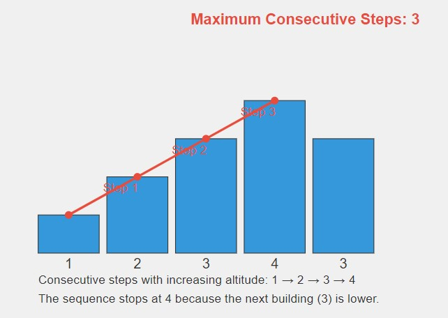

# Roof Top 🏙️

## Problem Statement


You are given the heights of consecutive buildings. You can move from the roof of one building to the roof of the next adjacent building. Your task is to find the maximum number of consecutive steps you can take while gaining an increase in altitude with each step.

### Function Description

You need to implement the following function:

```java
class Solution {
    // Function to find maximum number of consecutive steps
    // to gain an increase in altitude with each step.
    public int maxStep(int arr[]) {
        // Your code here
    }
}

Function Name: maxStep
Input: An array arr[] of integers where each element represents the height of a building.
Output: Return the maximum number of consecutive steps where each next building's height is greater than the previous one.
```

### **Input Format**

- An integer array arr[] representing the heights of consecutive buildings.

### **Output Format**

- Return an integer representing the maximum consecutive steps where each building is taller than the previous.

## 📊 Examples

### Example 1

#### Input:

```
arr = [1, 2, 2, 3, 2]
```

**Output:**

```java
1
```

### Explanation:

Maximum consecutive buildings with increasing heights are 1 → 2 and 2 → 3.

### Example 2

#### Input

```
arr = [1, 2, 3, 4]
```

**Output:**

```java
3
```

#### Explanation:

Maximum consecutive buildings with increasing heights are 1 → 2 → 3 → 4.

## 🧠 Approach and Solution

- Traverse the array and count the number of consecutive buildings where each next building is taller.
- Reset the count when the sequence breaks and track the maximum count.
- Return the maximum count of consecutive steps.

# Time Complexity

O(n), where n is the length of the array.

# Space Complexity

O(1), as only constant extra space is used.

# Contributions

Feel free to contribute by sharing your insights, optimizations, or any alternative approaches you have for solving this problem. Pull requests are welcome!

# Contact

For any questions or suggestions, please contact me
