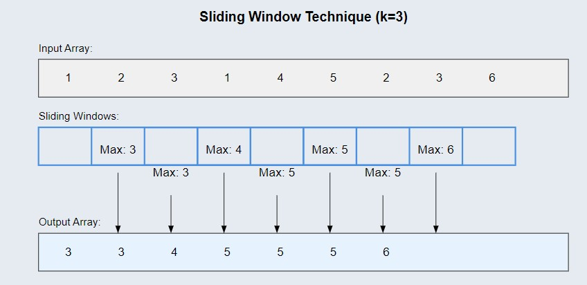

# K Sized Subarray Maximum 📊

## Problem Statement

Given an array `arr[]` and an integer `k`, find the maximum for each and every contiguous subarray of size `k`.

### Function Description

You need to implement the following function:

```java
class Solution {
    // Function to find maximum of each subarray of size k.
    public ArrayList<Integer> max_of_subarrays(int k, int arr[]) {
        // Your code here
    }
}
- Function Name: max_of_subarrays
- Input: An integer array arr[] and an integer k representing the size of the subarray.
- Output: A list of integers containing the maximum values of each subarray of size k.
```

### **Input Format**

- An integer k and an integer array arr[].

### **Output Format**

- Return a list of integers representing the maximum value of each contiguous subarray of size k.

## 📊 Examples

### Example 1

#### Input:

```
arr = [1, 2, 3, 1, 4, 5, 2, 3, 6], k = 3
```

**Output:**

```java
[3, 3, 4, 5, 5, 5, 6]
```

### Explanation:


1st contiguous subarray = [1 2 3] max = 3
2nd contiguous subarray = [2 3 1] max = 3
3rd contiguous subarray = [3 1 4] max = 4
4th contiguous subarray = [1 4 5] max = 5
5th contiguous subarray = [4 5 2] max = 5
6th contiguous subarray = [5 2 3] max = 5
7th contiguous subarray = [2 3 6] max = 6

### Example 2

#### Input

```
arr = [8, 5, 10, 7, 9, 4, 15, 12, 90, 13], k = 4
```

**Output:**

```java
[10, 10, 10, 15, 15, 90, 90]
```

#### Explanation:

1st contiguous subarray = [8 5 10 7], max = 10
2nd contiguous subarray = [5 10 7 9], max = 10
3rd contiguous subarray = [10 7 9 4], max = 10
4th contiguous subarray = [7 9 4 15], max = 15
5th contiguous subarray = [9 4 15 12], max = 15
6th contiguous subarray = [4 15 12 90], max = 90
7th contiguous subarray = {15 12 90 13}, max = 90

## 🧠 Approach

- Use a deque to store indexes of useful elements for each window.
- The deque will store indexes in decreasing order of values in the array.
- Traverse through the array, and for each element, remove elements from the deque that are out of bounds and that are smaller than the current element.
- The front of the deque will always have the maximum element for the current window.
- Append the maximum element for each window to the result list.

# Time Complexity

O(n) where n is the length of the array.

# Space Complexity

O(k) for storing elements in the deque.

# Contributions

Feel free to contribute by sharing your insights, optimizations, or any alternative approaches you have for solving this problem. Pull requests are welcome!

# Contact

For any questions or suggestions, please contact me
