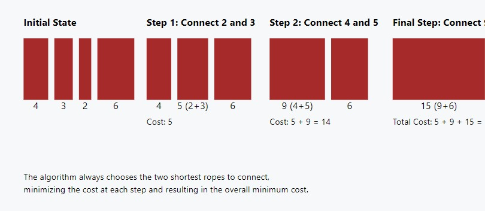

# Minimum Cost of Ropes 🔗

## Problem Statement

Given an array `arr` containing the lengths of different ropes, we need to connect these ropes to form one single rope. The cost to connect two ropes is equal to the sum of their lengths. The task is to connect the ropes with the minimum cost.

### Function Description

You need to implement the following function:

```java
class Solution {
    // Function to return the minimum cost of connecting the ropes.
    public long minCost(long[] arr);
}
```

### **Input Format**

- An integer array arr[] (1 ≤ |arr| ≤ 1000, 1 ≤ length of each rope ≤ 10^6) that contains the lengths of the ropes.

### **Output Format**

- Return the minimum cost required to connect all the ropes.

## 📊 Examples

### Example 1

#### Input:

```
arr[] = [4, 3, 2, 6]

```

**Output:**

```java
29
```

### Explanation:


We can connect the ropes in following ways.

1. First connect ropes of lengths 2 and 3. Which makes the array [4, 5, 6]. Cost of this operation 2 + 3 = 5.
2. Now connect ropes of lengths 4 and 5. Which makes the array [9, 6]. Cost of this operation 4 + 5 = 9.
3. Finally connect the two ropes and all ropes have connected. Cost of this operation 9 + 6 =15
4. Total cost for connecting all ropes is 5 + 9 + 15 = 29. This is the optimized cost for connecting ropes.

- Other ways of connecting ropes would always have same or more cost. For example, if we connect 4 and 6 first (we get three rope of 3, 2 and 10), then connect 10 and 3 (we gettwo rope of 13 and 2). Finally we connect 13 and 2. Total cost in this way is 10 + 13 + 15 = 38.

### Example 2

#### Input

```
arr[] = [4, 2, 7, 6, 9]

```

**Output:**

```java
62
```

#### Explanation:

- First, connect ropes 4 and 2, which makes the array [6, 7, 6, 9]. Cost of this operation 4 + 2 = 6.
- Next, add ropes 6 and 6, which results in [12, 7, 9]. Cost of this operation 6 + 6 = 12.
- Then, add 7 and 9, which makes the array [12,16]. Cost of this operation 7 + 9 = 16. And
- finally, add these two which gives [28]. Hence, the total cost is 6 + 12 + 16 + 28 = 62.

## 🧠 Approach and Solution

- Use a priority queue (min-heap) to efficiently connect the two smallest ropes.
- Continuously remove the two smallest ropes, calculate the connection cost, and add the new rope back to the heap until only one rope remains.

# Time Complexity

O(nlogn)

# Space Complexity

O(n)

# Contributions

Feel free to contribute by sharing your insights, optimizations, or any alternative approaches you have for solving this problem. Pull requests are welcome!

# Contact

For any questions or suggestions, please contact me
