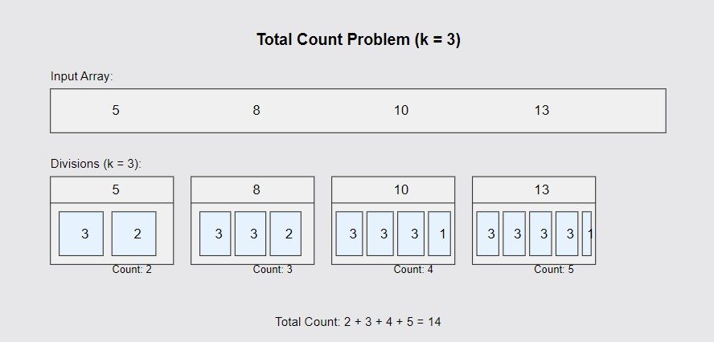

# Total Count 📊

## Problem Statement

You are given an array `arr[]` of positive integers and a threshold value `k`. For each element in the array, divide it into the minimum number of small integers such that each divided integer is less than or equal to `k`. Compute the total number of these integers across all elements of the array.

### Function Description

You need to implement the following function:

```java
class Solution {
    int totalCount(int k, int[] arr) {
        // code here
    }
}
Function Name: totalCount
Input:
k - the threshold value.
arr - array of integers representing elements.
Output: Total number of integers needed across all elements of the array.
```

### **Input Format**

- Integer k, and an array arr[] of integers.

### **Output Format**

- A single integer, the total count.

## 📊 Examples

### Example 1

#### Input:

```
k = 3, arr[] = [5, 8, 10, 13]
```

**Output:**

```java
14
```

### Explanation:



#### Each number can be expressed as smaller numbers as follows:

`5` = 3 + 2 → `2` parts
`8` = 3 + 3 + 2 → `3 `parts
`10` = 3 + 3 + 3 + 1 →` 4` parts
`13` = 3 + 3 + 3 + 3 + 1 → `5` parts
Total = `2 + 3 + 4 + 5` = `14`.

### Example 2

#### Input

```
k = 4, arr[] = [10, 2, 3, 4, 7]
```

**Output:**

```java
8
```

#### Explanation:

#### Each number can be expressed as smaller numbers as follows:

`10` = 4 + 4 + 2 → `3` parts
`2` = 2 → `1` part
`3` = 3 → `1 `part
`4` = 4 → `1 `part
`7` = 4 + 3 → `2 `parts
Total = `3 + 1 + 1 + 1 + 2` = `8`.

## 🧠 Approach

1. Iterate through each element of the array.
2. For each element, calculate how many integers are needed such that each part is ≤ k.
3. The formula for the count of parts for each element is `ceil(arr[i] / k)`. This can be computed using integer division: `(arr[i] + k - 1) // k`.
4. Sum the counts for all elements.

# Time Complexity

O(n), where n is the size of the array.

# Space Complexity

O(1), since no extra space is used.

# Contributions

Feel free to contribute by sharing your insights, optimizations, or any alternative approaches you have for solving this problem. Pull requests are welcome!

# Contact

For any questions or suggestions, please contact me
