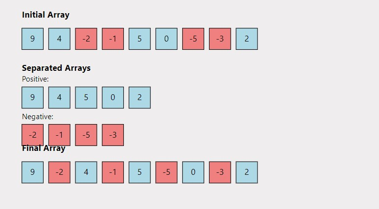

# Alternate Positive and Negative Numbers 🔄

## Problem Statement

Given an unsorted array `arr` containing both positive and negative numbers, rearrange the array to convert it into an array of alternate positive and negative numbers without changing the relative order.

### Requirements

- The resulting array should start with a positive integer (0 will also be considered as a positive integer).
- If any of the positive or negative integers are exhausted, add the remaining integers in the answer as they are, maintaining their relative order.
- The array may or may not have an equal number of positive and negative integers.

### Function Description

You need to implement the following function:

```java
class Solution {
    void rearrange(ArrayList<Integer> arr) {
        // code here
    }
}
```

### **Input Format**

- An ArrayList of integers arr.

### **Output Format**

- The rearranged array of alternate positive and negative numbers.

## 📊 Examples

### Example 1

#### Input:

```
arr[] = [9, 4, -2, -1, 5, 0, -5, -3, 2]

```

**Output:**

```java
9 -2 4 -1 5 -5 0 -3 2
```

### Explanation:

The positive numbers are [9, 4, 5, 0, 2] and the negative integers are [-2, -1, -5, -3]. Starting with the positive integer 9, we rearrange as follows: 9, -2, 4, -1, 5, -5, 0, -3, 2.

### Example 2

#### Input

```
arr[] = [-5, -2, 5, 2, 4, 7, 1, 8, 0, -8]
```

**Output:**

```java
5 -5 2 -2 4 -8 7 1 8 0
```

#### Explanation:

The positive numbers are [5, 2, 4, 7, 1, 8, 0] and the negative integers are [-5, -2, -8]. Starting with the positive integer 5, we rearrange as: 5, -5, 2, -2, 4, -8, 7, 1, 8, 0.

## 🧠 Approach and Solution



- Create two lists: one for positive numbers and one for negative numbers.
- Iterate through the positive and negative lists, alternately adding elements to the result list.
- Append any remaining elements from the non-exhausted list, maintaining the relative order.

# Time Complexity

O(n)

# Space Complexity

O(n)

# Contributions

Feel free to contribute by sharing your insights, optimizations, or any alternative approaches you have for solving this problem. Pull requests are welcome!

# Contact

For any questions or suggestions, please contact me
