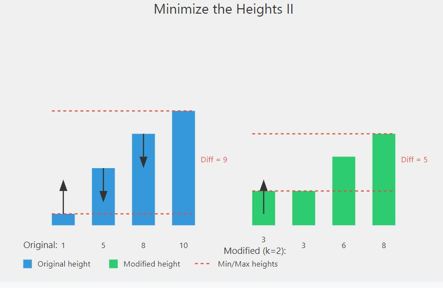

# Minimize the Heights II ⛰️

## Problem Statement

Given an array `arr[]` denoting the heights of N towers and a positive integer K, for each tower, you must perform exactly one of the following operations exactly once:

- Increase the height of the tower by K
- Decrease the height of the tower by K

Your task is to find the minimum possible difference between the height of the shortest and tallest towers after you have modified each tower.

### Function Description

You need to implement the following function:

```java
class Solution {
    int getMinDiff(int[] arr, int k) {
        // code here
    }
}
```

### **Input Format**

- arr[]: An array of integers denoting the heights of towers.
- k: A positive integer.

### **Output Format**

- A single integer representing the minimum possible difference between the tallest and shortest towers.

## 📊 Examples

### Example 1

#### Input:

```
arr[] = {1, 5, 8, 10}, k = 2
```

**Output:**

```java
5

```

### Explanation:

The array can be modified as {3, 3, 6, 8}. The difference between the largest and smallest is 8 - 3 = 5.

### Example 2

#### Input

```
arr[] = {3, 9, 12, 16, 20}, k = 3
```

**Output:**

```java
11
```

#### Explanation:

The array can be modified as {6, 12, 9, 13, 17}. The difference between the largest and smallest is 17 - 6 = 11.

## 🧠 Approach and Solution



1. Sort the array to easily compute minimum and maximum values.
2. Modify the elements either by adding or subtracting K while ensuring that no height becomes negative.
3. Compute the possible minimum and maximum heights and update the minimum difference accordingly.
4. Return the smallest possible difference between the modified tallest and shortest towers.

# Time Complexity

O(|x|), where |x| is the length of the string.

# Space Complexity

O(|x|), where |x| is the length of the string.

# Contributions

Feel free to contribute by sharing your insights, optimizations, or any alternative approaches you have for solving this problem. Pull requests are welcome!

# Contact

For any questions or suggestions, please contact me
